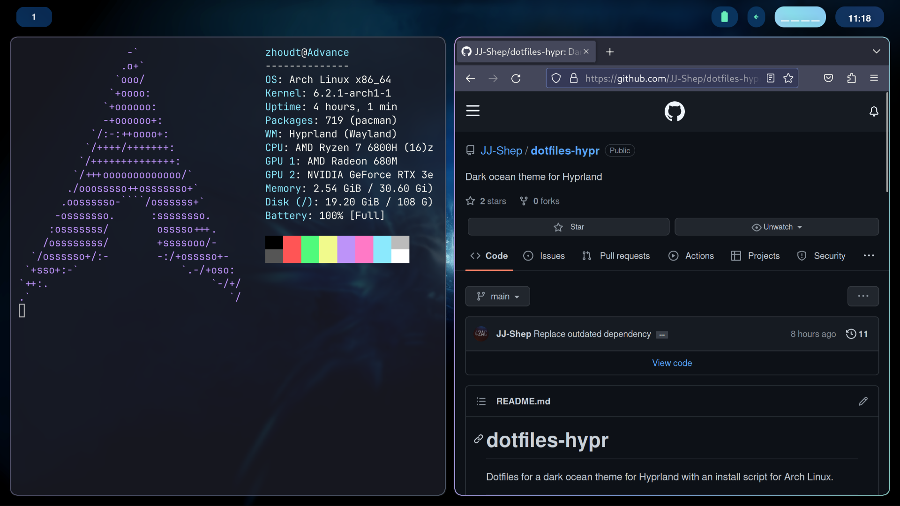

# dotfiles-hypr
Dotfiles for a dark ocean theme for Hyprland with an install script for Arch Linux.

### Dependencies (installed by script)
	
	[AUR] swww (Wallpaper client)
	
	[AUR] hyprland (Tiling window manager)

	[AUR] waybar-hyprland-git (Bar for Hyprland)

	[AUR] wofi (App launcher)

	[AUR] fastfetch (Fetch tool)

	sddm (Display manager)

	wezterm (Terminal emulator)

	firefox (Browser)

	vim (Text editor)

	ttf-iosevka-nerd (Terminal font)

### Instructions

To install for Arch Linux, run the installation script (`./install-arch.sh`). For other distributions, install required packages and manually move things to their respective directories. Be advised that things may not work properly on distributions other than Arch.

### Credits

https://github.com/linuxmobile/hyprland-dots (Wezterm configuration)

https://github.com/flick0/dotfiles/tree/aurora/config (Waybar config minus colors, scripts for Hyprland) 
