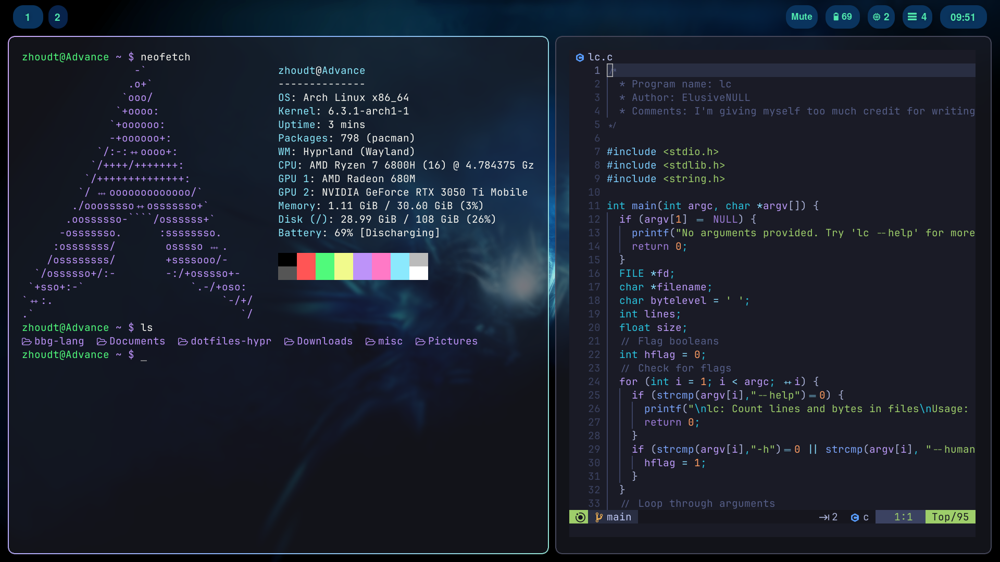

# dotfiles-hypr
Dotfiles for a dark ocean theme for Hyprland with an install script for Arch Linux.

[Advisory] I was recently made aware of Hyprland's toxic community, I do *not* associate with them.

### Instructions

To install for Arch Linux, run the installation script (`./install-arch.sh`). For other distributions, install required packages and manually move things to their respective directories. Be advised that things may not work properly on distributions other than Arch.

### Credits

https://github.com/flick0/dotfiles/tree/aurora/config (Scripts for Hyprland)
