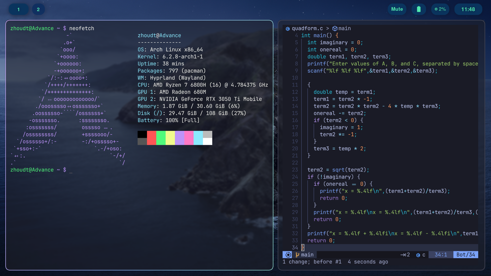

# dotfiles-hypr
Dotfiles for a dark ocean theme for Hyprland with an install script for Arch Linux.



### Instructions

To install for Arch Linux, run the installation script (`./install-arch.sh`). For other distributions, install required packages and manually move things to their respective directories. Be advised that things may not work properly on distributions other than Arch.

If you do not want to run the install script or you're using a non-Arch based distribution, the dependencies are as follows:
```
swww hyprland waybar-hyprland-git wofi sddm wezterm firefox pulseaudio-alsa pavucontrol swaylockd
```

Required fonts: Cantarell, Font Awesome, Iosevka Nerd Font

### Credits

https://github.com/linuxmobile/hyprland-dots (Wallpaper)

https://github.com/flick0/dotfiles/tree/aurora/config (Scripts for Hyprland)
